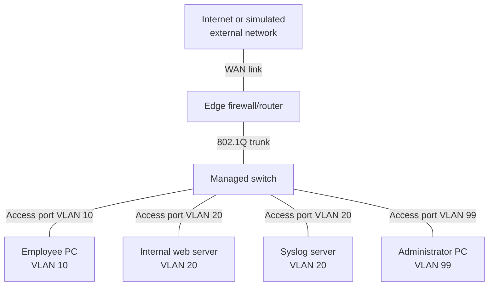

# Network Topology

## Topology diagram

## Proposed switch ports

| Switch port         | Connected device    | Port mode |       VLAN |
| ------------------- | ------------------- | --------- | ---------: |
| GigabitEthernet 0/1 | Firewall/router     | Trunk     | 10, 20, 99 |
| FastEthernet 0/1    | Employee PC         | Access    |         10 |
| FastEthernet 0/2    | Internal web server | Access    |         20 |
| FastEthernet 0/3    | Syslog server       | Access    |         20 |
| FastEthernet 0/4    | Administrator PC    | Access    |         99 |
| Remaining ports     | Unused              | Disabled  |       None |

## Firewall

- This will be the central security device
  It should perform:
- Routing between VLANs
- Filtering between VLANs
- DHCP (if supported by choosen platform)
- NAT for internet access
- Logging of permitted and blocked traffic
- Firewall adim from VLAN 99

## Switch

This will provide:

- VLAN creation
- Access ports for end devices
- A trunk to the firewall
- A management address in VLAN 99
- Switch-port security and hardening

# VLANs

## VLAN 10: Employees

- This contains normal employee devices
- Employees will have the DHCP apply network settings
- They need internet access and limited access to approved internal services
- They shouldn't be able to mange or freely explore the server VLAN

### Example

- EMPLOYEE-PC-01
- Address asigned with DHCP
- Expected range: 192.168.10.100 - 192.168.10.199

## VLAN 20: Servers

- Servers normally use static addresses cause clients and firewalls need to know where to find them
- Initally one machine can provide both web service and logging service.
- Later it will be split as seen in the topology diagram.

### Example

- Internal web server: 192.168.20.10
- Central syslog server: 192.168.20.20
  Employee devices might be allowed to access HTTPS on the web server but not SSH, file sharing, databse ports or other unnecessary services

## VLAN 99: Administration

- This is the most trusted network
  It contains:
- Admin workstation
- Firewall management interface
- Switch management interface
- Ant future monitoring or config systems

## Design decisions

The firewall/router performs inter-VLAN routing. This ensures that traffic moving between security zones can be inspected and filtered.

The firewall connection to the switch is an IEEE 802.1Q trunk carrying VLANs 10, 20 and 99.

Endpoint connections use access ports assigned to a single VLAN.

Employee devices use DHCP. Servers and network infrastructure use static addresses so that firewall rules and management systems can reliably locate them.
